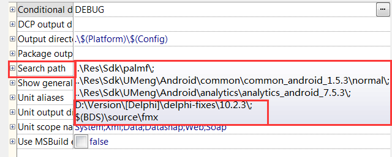

### 使用方法
-   方法一：
	-  1. 拷贝需要的补丁文件到你的工程目录
	-  2. 拷贝编译的时候缺少或错误的文件到你的工程目录
	-  优缺点：每次都需要拷贝文件，费时费力
-   方法二：
  -  1. 添加补丁路径到工程的搜索路径，例如：**你的补丁路径\delphi-fixes\10.2.3\\**
  -  2. 如果出现编译版本不一样，或者需要引用其他单元，可以在搜索路径加上对应的源码路基路径，例如：**$(BDS)\source\fmx**
  -  3. 本方法是利用搜索路径是从前到后的，所以源码会优先使用补丁的，然后再从delphi源码中读取缺失的部分
  -  优缺点：修改简单，只需要修改引用路径。但因为引用了delphi的源码目录，导致很多文件需要编译，所以一次会比较慢
  -  

###  目录说明
-  每个版本号一个文件夹，每个文件夹下有如下文件夹
-  Fixes 补丁目录
-  Original 原始文件目录

###  感谢列表
-   感谢老猫和flying wang提供的不看后悔
-   感谢DelphiTeacher提供的OrangeUI中的补丁
-   感谢qdac作者swish提供的fmx补丁
-   感谢AONE的各种补丁
-   感谢Zeus64的补丁